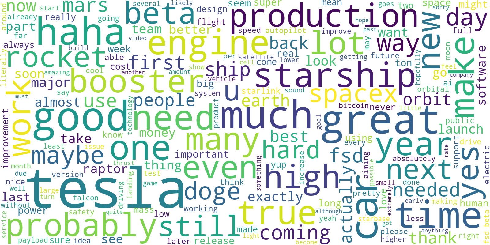
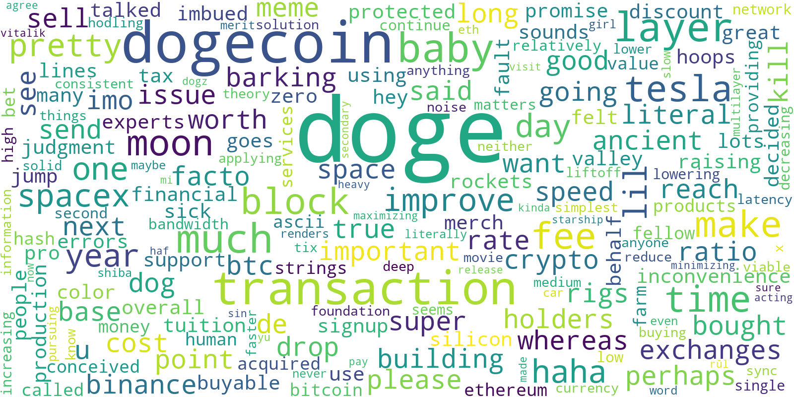
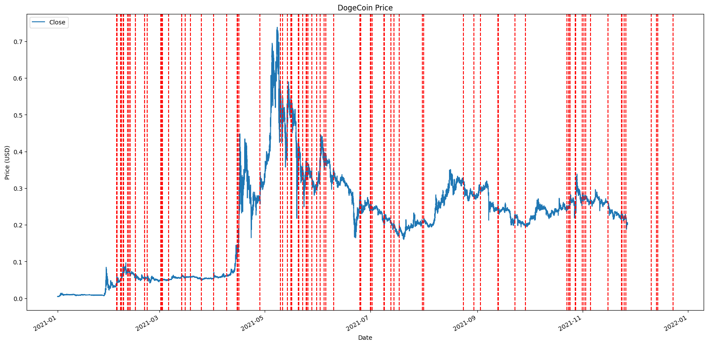
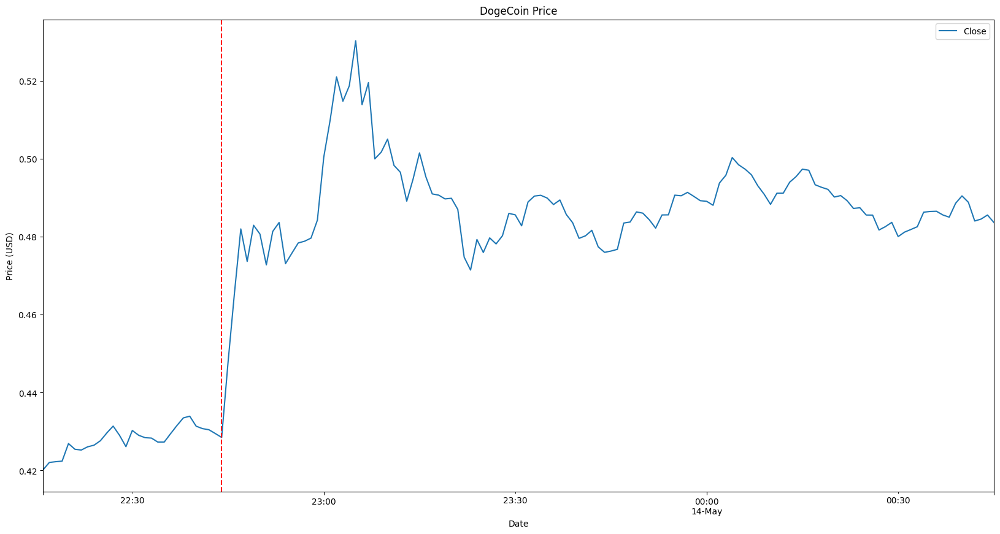

The Twitterverse has witnessed it all. Elon Musk mentions anything about Dogecoin, and the price skyrockets. Donald Trump tweets about anything, and the price goes pluging. But is there any substance behind this social media and crypto connection? Can trading decisions be based on Twitter trends? Let's dive in and explore the possibilities.

<blockquote class="twitter-tweet">
Time is the ultimate currency
&mdash; Elon Musk (@elonmusk) <a href="https://twitter.com/elonmusk/status/1433713164546293767?ref_src=twsrc%5Etfw">September 3, 2021</a></blockquote> 

> Edit: A moment of silence please for the ~~Twitter~~ X API. [Rest in peace](https://www.wired.co.uk/article/twitter-data-api-prices-out-nearly-everyone).

## The Data

To embark on this journey, we need data. We require both the crypto price data and the tweets. While my focus here is on Elon Musk's Dogecoin tweets](https://twitter.com/elonmusk/status/1485953263040188416), the method applies to any cryptocurrency and Twitter account. My data sources of choice, limited to 2021, are as follows:
- [Dogecoin price data](https://www.kaggle.com/datasets/yamqwe/cryptocurrency-extra-data-dogecoin)
- [Elon Musk tweets](https://www.kaggle.com/datasets/ayhmrba/elon-musk-tweets-2010-2021)

Let's start off by doing some basic analysis on Elon's tweets, and creating a [word cloud](https://github.com/amueller/word_cloud) formed from all the words in his tweets.

Spot it? Right next to "tesla" is the word "doge." This is our focal point. Now, let's create another word cloud, but this time, we'll include only tweets containing "doge."

As you may have deduced, Elon is fond of tweeting about Dogecoin. But does the world care? Let's take a look at the price of Dogecoin over time, and when Elon tweets about it.

Hmm. Not very enlightening, right? It's time for a closer inspection. Let's delve into a few examples.

<blockquote
class="twitter-tweet">
Working with Doge devs to improve system transaction efficiency. Potentially promising.
&mdash; Elon Musk (@elonmusk) <a href="https://twitter.com/elonmusk/status/1392974251011895300?ref_src=twsrc%5Etfw">May 13, 2021</a></blockquote> 

Let's take a look at this one. A big announcement from Elon. Any guesses about Dogecoin's price movement?

This tweet is a prime example of how a simple message can sway the market. Within minutes of this tweet hitting the feeds, the price of Dogecoin experienced a staggering 20% jump. The power of Elon Musk's words was in full display, showcasing how the market is influenced by his tweets.

This incident is by no means an anomaly. Among the 26 tweets (**excluding replies**) containing the word "doge," an astonishing 23 of them triggered price hikes in Dogecoin. On average, just 15 minutes after these tweets, the price increased by an impressive 7.24%. This discovery shatters any notion of coincidence; it's a pattern that can't be ignored.

~~The moral of the story, is if you want to make money, just follow Elon Musk on Twitter, and get ready to remortgage your house to buy Dogecoin. Your next trip to the moon is just a tweet away.~~

**DISCLAIMER: NOT FINANCIAL ADVICE, TWITTER IS NOT A SUITABLE SOURCE OF FINANCIAL INFORMATION.**