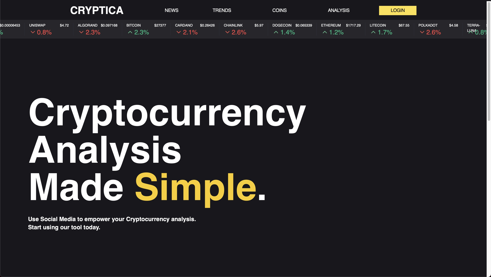
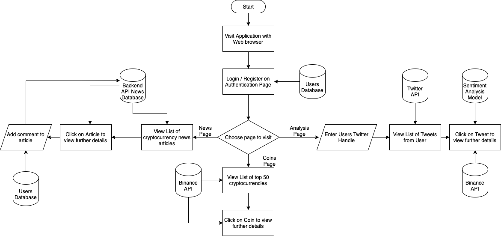
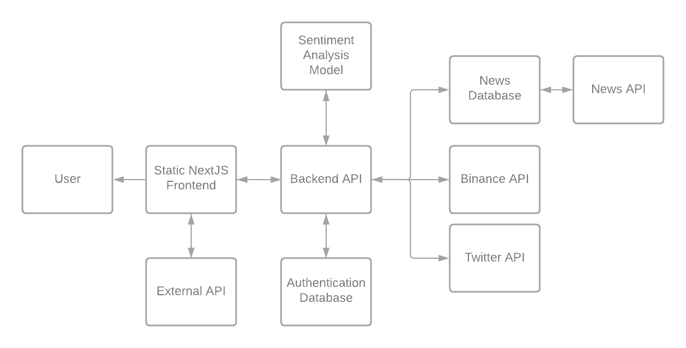
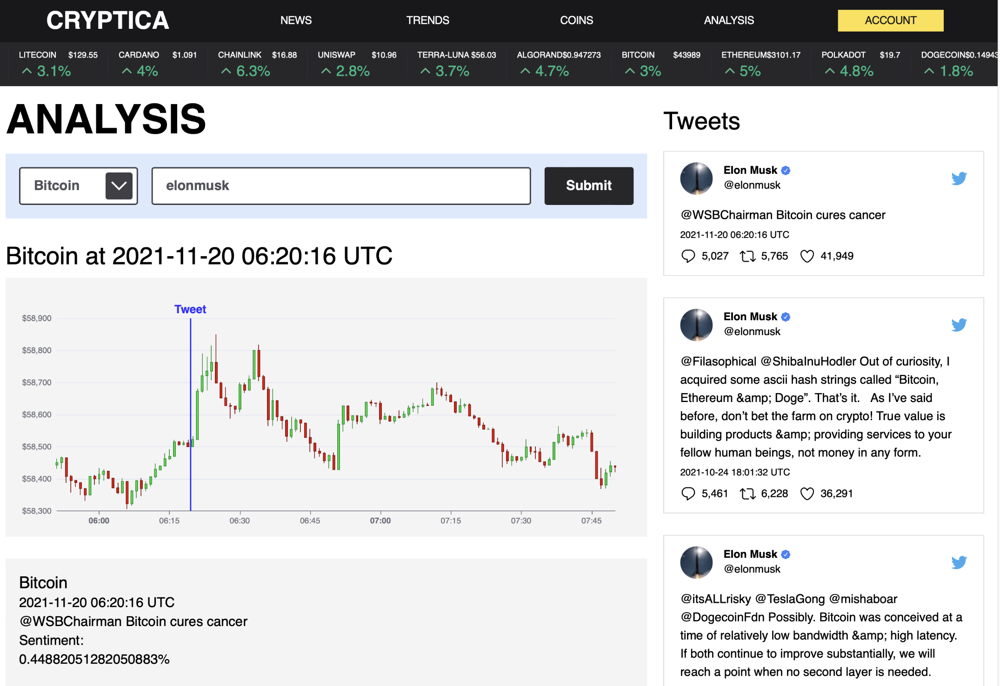

# Introduction
As part of A Level Computer Science, we were all required to do a coursework project, worth 20% of our total grade. The project could be on any topic, as long as it was related to Computer Science. I chose to do a project investigating the relationship between social media and crypto prices. Read on to find out more.

**Important Note:** This is part 2 of a 2 part article. [Part 1]({{site.url}}/2022-08-01-tweet-based-trading) focuses on the general ideas behind the project. Part 2 focuses on the implementation of the project. If you haven't read [part 1]({{site.url}}/2022-08-01-tweet-based-trading), I would recommend reading it first.

If you want to see the finished result and the full PDF of my project, you can <a href="../assets/coursework.pdf">find it here</a>. It provides a full background to the project, and explains all the decisions made along the way. 
> **WARNING**: The finished document is 234 pages long, and not a fun read... For a summary of the project, just read this article instead.

For a full demo of the finished product, watch the video below.

<iframe width="100%" height="400" src="https://www.youtube-nocookie.com/embed/zSj_id9I7-c?si=HW_rFUWgDLRiyPr5" title="YouTube video player" frameborder="0" allow="accelerometer; autoplay; clipboard-write; encrypted-media; gyroscope; picture-in-picture; web-share" allowfullscreen></iframe>

# Requirements

My idea was to build a full stack application, allowing a user to analyse the relationship between social media and crypto prices. The application would allow a user to monitor the impact that specific users have on the markets, in particularly focusing on high influence accounts such as Elon Musk.

As part of the coursework, we had to document every step of the project, and labouriously explain every decision we made. The first step was to ~~create~~ find a ~~definitely-real-and-not-made-up~~ client, and ask them whay they wanted. I created the following summary of the requirements:

> My client is a retail investor, and he primarily bases his investment decisions based on his own research. His research primarily consists of analysing news articles, and social media sentiment. My client has noticed that high profile celebrities such as Donald Trump and Elon Musk can have a large impact on the price of assets based on a short social media post. In fact, Elon Musk has previously got in trouble in the past with the SEC for tweeting regarding Tesla’s stock. Cryptocurrencies however are a very unregulated market, and Elon Musk has tweeted about them several times with no consequences.

> My client wishes for a web application to be able to analyse the effect certain social media posts have on the price of cryptocurrencies, with a program that generates graph such as the one above to show the impact.

> With my other clients investments, he keeps informed on current events and news by reading newspapers such as the Financial Times, which offer a range of high quality articles on most things affecting the stock market. Cryptocurrencies however do not typically feature frequently in publications like the Financial Times, meaning that my client has to look elsewhere for news related to cryptocurrencies. He would also like to be able to see a collection of Cryptocurrency related news articles in one place, saving him from searching across multiple publications.

 
See the flowchart below for an easier to understand view of what the program was to do.

Basically, I was to build a full stack application that had the following functionality:
- Persistent User Authentication
- A Twitter Account analysis tool, displaying an overview of relevant statistics about a user
- A Specific Tweet Analysis tool, monitoring the sentiment and impact on the cryptocurrency market of a tweet
- News Article Scraping and Storing, to display a summary of the headlines to users
- The ability to comment on articles with your account
- A Cryptocurrency Markets Overview page
- Specific Pages for all of the top 50 coins, showing historical price data, and related news articles

# Implementation

My application consisted of two main parts, a [NextJS](https://nextjs.org) front end client, and a [FastAPI](https://fastapi.tiangolo.com) Python API server. The idea was that NextJS could server side render all the pages that don't change in advanced, and then use client side fetching to the API to get anything that couldn't be dealt with beforehand.

As part of the project, we were heavily discouraged from using third party libraries unless we had to. This meant that even for parts of the app such as authentication, we were encouraged to use our own implementation rather than rely on the existing solutions. Whilst this is an [absolutely terrible idea](https://withblue.ink/2020/04/08/stop-writing-your-own-user-authentication-code.html), especially when it comes to authentication, we were encouraged to do so in order to get high marks.

My designed system essentially looked like the following.

### The Frontend

As mentioned, I chose to use NextJS for the client. This was my first time playing with server side rendering, and I thoroughly enjoyed it. The fun syntax of React components with the performance benefit of server side rendering is a great combo. Server side rendering allowed me to prerender most but not quite all of the pages in my app.

In terms of the analytical aspect of the application, I essentially translated the code that was originally employed to generate the diagrams in  <a href="../2022-08-01-tweet-based-trading/">part 1</a> into JavaScript, and made them look a bit prettier. Essentially the client would fetch all the relevant data such as price data and tweet data from the API, and render them nicely on the page for the user to play with. You can see below what it looked like. The user could scroll the searched tweets and select them on the right, and the graph would pop up showing how the market reacted. Watch the demo at the top of the page for the full picture.

### The Backend

When it came to choosing a library for building my API, I explored several options, but ultimately I settled on FastAPI. The syntax of FastAPI appealed to me, and at that time, it seemed to be the most performant Python library available for creating APIs. I integrated FastAPI with a Postgres Database server, which served as the repository for all the persistent data, such as user information and scraped news articles.

The API server I developed utilized an integrated approach to interact with various external API services, such as the Binance API and Twitter API. To connect with these services, I implemented dedicated modules that encapsulated the necessary API calls and data handling. Additionally, the server was equipped with a scraping mechanism for gathering news articles from diverse sources. Employing a Python web scraping library, I implemented a scheduled scraping routine to extract relevant news content from chosen websites, parsing and organizing the data for storage in the Postgres Database. This approach enabled the API server to not only interact seamlessly with external APIs but also to autonomously aggregate up-to-date news content, enriching the user experience with timely information.

One of the most challenging aspects of developing the backend was implementing authentication.  For some reason, I decided to take on the task of building authentication from scratch, a decision that, in hindsight, was a terrible idea for any production deployed application.  To achieve this, I opted to utilize [JSON Web Tokens (JWTs)](https://jwt.io/introduction) in conjunction with [RSA encryption](https://brilliant.org/wiki/rsa-encryption/). This approach provided a secure way to manage authentication and authorization within the system.

By combining FastAPI, a performant choice for building APIs, with the robustness of Postgres for data storage and the security of JWTs with RSA encryption for authentication, I was able to create a robust backend that powered my application effectively.

# Conclusion

Building the app was a fun and challenging experience that taught me many new things about full stack development. If you are interested in the details about the application, you can <a href="../assets/coursework.pdf">read the full document</a> here. Unfortunately the app is broken, due to the ~~Twitter~~ X API Changes, enacted ironically by one of the people who this project was focused around. I achieved 73/75 marks for the project, so I guess the 234 pages of writing paid off.