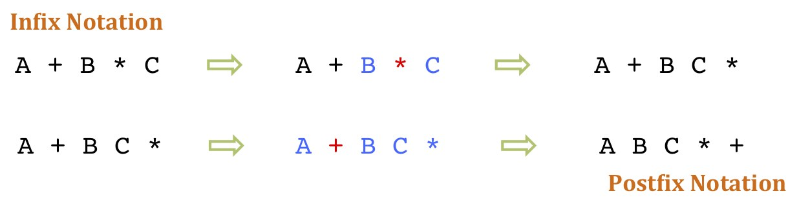

# Introduction

As my first year of university comes to a close, I thought it would be fun to look back on some of the coursework I've completed. Unfortunately I'm not allowed to share the code for any of these projects (university rules), but I can share my thoughts.

# Saturated Reverse Polish Notation Calculator
Our first introduction to coursework at University was to create a [Satured Reverse Polish Notation](https://en.wikipedia.org/wiki/Reverse_Polish_notation) (SRPN) Calculator. Rather than being given a set of requirements and documentation, our job was to reverse engineer the compiled program and implement as many of the features we could find in Python. This proved quite challenging, as there was a whole host of features to be discovered by trial and error, with limited time.

The project required the use of a stack to store the numbers and allow them to be evaluated in [postfix notation](https://en.wikipedia.org/wiki/Reverse_Polish_notation), instead of the [infix notation](https://en.wikipedia.org/wiki/Infix_notation) we are all used to. This was a great introduction to the concept of stacks, and how they can be used to solve problems.

Overall I enjoyed the project and thought it was a good start to the year.

## Ratings
- Difficulty: 3/5
- Enjoyment: 3.5/5
- Learning: 4/5
- Marked Grade: 78.5%

# Sudoku Solver

The next project as part of the Artificial Intelligence module was to build a Sudoku Solver in Python. This was quite a step up from the previous project, and required applying several artificial intelligence concepts we had been taught. The project criteria was simple: given a sudoku puzzle, return the solved puzzle, with computation time taken to solve being a factor in the marking.

First of all, we were encouraged to implement a basic [backtracking](https://en.wikipedia.org/wiki/Backtracking) algorithm using recursion. This gave us an idea of how to approach the task, but was too slow to get a good grade. [Constraint Propogation](https://www.ibm.com/docs/en/icos/20.1.0?topic=optimizer-constraint-propagation) was the next step and allowed us to drastically reduce the number of possibilities for each cell and speed up the algorithm. Finally, I implemented a search algorithm to find the cell with the least number of possibilities, and try each of them in turn. This proved sufficient to get the top marks.

## Ratings
- Difficulty: 4/5
- Enjoyment: 5/5
- Learning: 5/5
- Marked Grade: 95% (100% for the algorithm, only lost marks for the report)

# Dungeon of Doom

The third project of the year was to build a 2D ascii dungeon crawler game in Java. We were given a hefty specification with a set of requirements, involving a player, items, map, and an enemy bot. The project was split into two parts, with the first part being to implement the game logic, and the second part being to implement the enemy bot.

The trickiest part of the project was the enemy bot, which required the implementation of a pathfinding algorithm. This involved a lot of trial and error and debugging, but eventually I managed to get it working perfectly. The bot would find the shortest path to the player, and follow it, avoiding obstacles along the way. This was my first introduction to Java and I found it quite enjoyable.

## Ratings
- Difficulty: 4/5
- Enjoyment: 3/5
- Learning: 3/5
- Marked Grade: 100% 🎉

# C and Java Exercises

The C and Java Exercises were actually two seperate bits of coursework, but there's not much to say about them. They were a series of small exercises to get us used to the syntax of the languages, and were quite enjoyable. I found the C exercises more challenging, as I had never used C before, but I found it quite enjoyable to learn a new language. The problems were similar to the likes of [Leetcode](https://leetcode.com/), with a difficulty of maybe Easy to Medium. There was also a question involving multithreading file handling in Java, which was quite interesting.

## Ratings
- Difficulty: 2.5/5
- Enjoyment: 2.5/5
- Learning: 3/5
- Marked Grade: 87% (C) and 97.5% (Java)

# Spam or Ham Classifier

Now onto the final and favourite project of the year. The Spam or Ham Classifier was a project to build a spam classifier using whatever implementation we wanted, as long as it was in Python and only used numpy. We were given a dataset of 1000 emails with features already extracted, and our goal was to build a classifier to be marked on an unseen dataset of emails. Over the year we had learned several different techniques for classification, including Naive Bayes and Nearest Neighbour, but we were encouraged to use whatever we wanted.

I experimented extensively on the dataset with different techniques. I eventually settled on a voting algorithm which combined the results of several different classifiers. This included [Nearest K Neighbours](https://www.ibm.com/topics/knn), [Naives Bayes](https://www.ibm.com/topics/naive-bayes), and [Logistic Regression](https://www.ibm.com/topics/logistic-regression). This allowed my classifier to achieve an accuracy of 93% on the unseen dataset, which was considered excellent.

## Ratings
- Difficulty: 4.5/5
- Enjoyment: 5/5
- Learning: 5/5
- Marked Grade: 93%

# Overall

Overall I enjoyed _most_ of the coursework I completed this year. I found the projects to be quite challenging, but also very rewarding. I ended the year with an average of 90% accross all my coursework, which I was pretty pleased with (anything above 70% is a first and considered "Outstanding"). I'm looking forward to next year, where I'll be taking on more challenging projects and learning new things.
