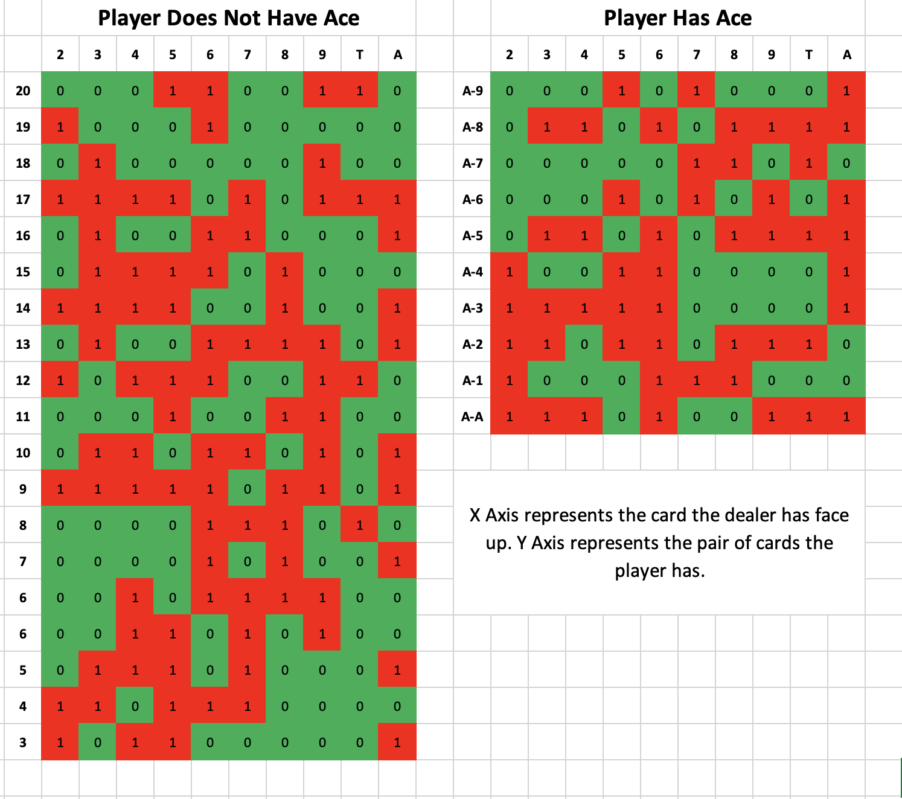

# Introduction

[Blackjack](https://en.wikipedia.org/wiki/Blackjack) is a game that is simple to learn but difficult to master. The game is played with a standard 52-card deck, with the aim of the game being to get as close to 21 as possible without going over. The player is dealt two cards, and can then choose to hit (be dealt another card) or stand (keep the cards they have). Before the player plays, the dealer is dealt two cards, one face up and one face down. The player then plays, and if they go over 21, they lose. If they don't go over 21, the dealer plays. The dealer must hit if their score is less than 17, and must stand if their score is 17 or more. The player with the highest score wins.

Given the simplicity of the game, yet the difficulty in mastering it, I thought it would be a good candidate for a genetic algorithm. Read on to find out how I used a genetic algorithm to learn how to play blackjack.

*Note: This article refers to a simplified version of blackjack, where the player can only hit or stand, and the dealer must hit if their score is less than 17. Often there are other options, such as splitting, doubling down, and surrendering. These options are not considered in this article, yet would be interesting to explore in the future and relatively easy to implement.*

# Genetic Algorithm

[A genetic algorithm](https://en.wikipedia.org/wiki/Genetic_algorithm) mimics the process of natural selection to solve complex problems. The algorithm starts with a population of individuals, each with a unique set of genes. After evaluating these individuals, the algorithm selects the most promising ones for reproduction. By merging the genes of these selected individuals, the algorithm breeds a new generation, progressing toward a solution through successive iterations.

# Training the Algorithm

The first thing and most important thing we had to do was define our AI agent's gameplay strategy. In blackjack, the dealer's face-up card holds vital information, influencing the player's decisions. The presence of an ace in the player's hand also adds a strategic layer, capable of representing either 1 or 11. Our AI agent's strategy is structured as follows:



This strategy essentially guides the agent's choices. Using the dealer's visible card and the agent's own hand, it determines whether the agent should hit or stand (represented by 0 and 1, respectively). The agent iteratively employs this strategy, hitting and re-evaluating as the game progresses. Initially, the strategy is generated randomly.

The algorithm kicks off by creating a diverse population of agents, each endowed with a distinct randomly generated strategy. Each agent's performance in the game varies based on its strategy.

Now we need a way to evaluate each agent. To do this, we have each agent play a large number of games of blackjack, and record the results. Effectively to do this we calculate how much money the agent has at the end of `N` games, betting £1 for each game. The rules of blackjack define the winning payout to be 1:1, unless you get blackjack (Ace + 10), in which case the payout is 3:2. Losing the game results in your bet being lost and drawing results in your bet being returned.

Now after we have tested each agent `N` times and got a score for each agent, we can select the best agents to reproduce. To do this, we will use a [tournament selection](https://en.wikipedia.org/wiki/Tournament_selection) method. The tournament selection works in the following way:


```
1. choose k (the tournament size) individuals from the population at random
2. choose the best individual from the tournament with probability p
3. choose the second best individual with probability p*(1-p)
4. choose the third best individual with probability p*((1-p)^2)
... and so on
```


Now we have selected the best agents, we can create a new population of agents. To do this, we will use a [crossover](https://en.wikipedia.org/wiki/Crossover_(genetic_algorithm)) method. I chose to use the uniform crossover method, which works in the following way:

```
for each gene in the policy grid, choose a random number either 0 or 1:
 - if the number is 0 take the gene from the first parent
 - if the number is 1 take the gene from the second parent
```

Two offspring are generated per parent pair, with the parents swapped for the second child.

This cycle of evaluation, selection, and reproduction continues until convergence on a solution is achieved.

## Mutation

One thing we haven't considered yet is mutation. Mutation is the process of randomly changing the genes of an individual. Through mutation we inject randomness into the gene pool, enabling the algorithm to explore the search space more effectively. Without mutation, the algorithm risks getting trapped in local optima, missing out on the global solution.

Implementing mutation is simple. First, we need to define a mutation chance. This is the probability that a gene will be mutated. Then for each gene in the policy grid, if the mutation chance is greater than a random number between 0 and 1, we will mutate the gene. To mutate the gene, we will simply set it randomly to either 0 or 1.

While mutation is crucial, excessive mutation can be detrimental. An overly high mutation chance disrupts convergence, preventing the discovery of an optimal solution. Striking the right balance in mutation chance is essential to the algorithm's success.

# Technical Implementation

Transitioning from the conceptual understanding to practical implementation, let's delve into the technical aspects. For this project, we are using ~~Python~~ C++ for it's speed and simplicity. 

> I actually originally wrote the code in Python, but worked out I could make it run literally 40 times faster by using C++ instead... so I did.

## Blackjack Engine

First of all, we need a way to play blackjack. For our agents to simulate games of blackjack many thousands of time per generation, we need a fast and efficient blackjack engine.

Blackjack is suit agnostic, meaning that the suit of a card is irrelevant. All face cards (Jack, Queen, King) are also equal to 10, meaning that there are only actually 10 unique card types (2 through 10 + ace). Casinos also typically play blackjack with multiple decks, sometimes as many as 8. Whilst it would be better to simulate blackjack with the same number of decks as the casino, for simplicity we are simulating an infinite number of decks. This means that the probability of drawing a card is always the same, regardless of what cards have been drawn previously.

```cpp
Deck::Deck() : 
    cards{2, 3, 4, 5, 6, 7, 8, 9, 10, 10, 10, 10, 11},
    gen(rd()),
    dis(0, 12)
{}

int Deck::deal() { 
    return cards[dis(gen)]; 
}

```

Here is the code for the deck. We have a vector of cards, with the values of each card. We then have a random number generator, which we use to generate a random number between 0 and 12, which we use to index the vector of cards. This is all we need to quickly and efficiently simulate pulling a card from a deck.

... To be finished ...

# Parameters
Coming soon...

# Results
Coming soon...

