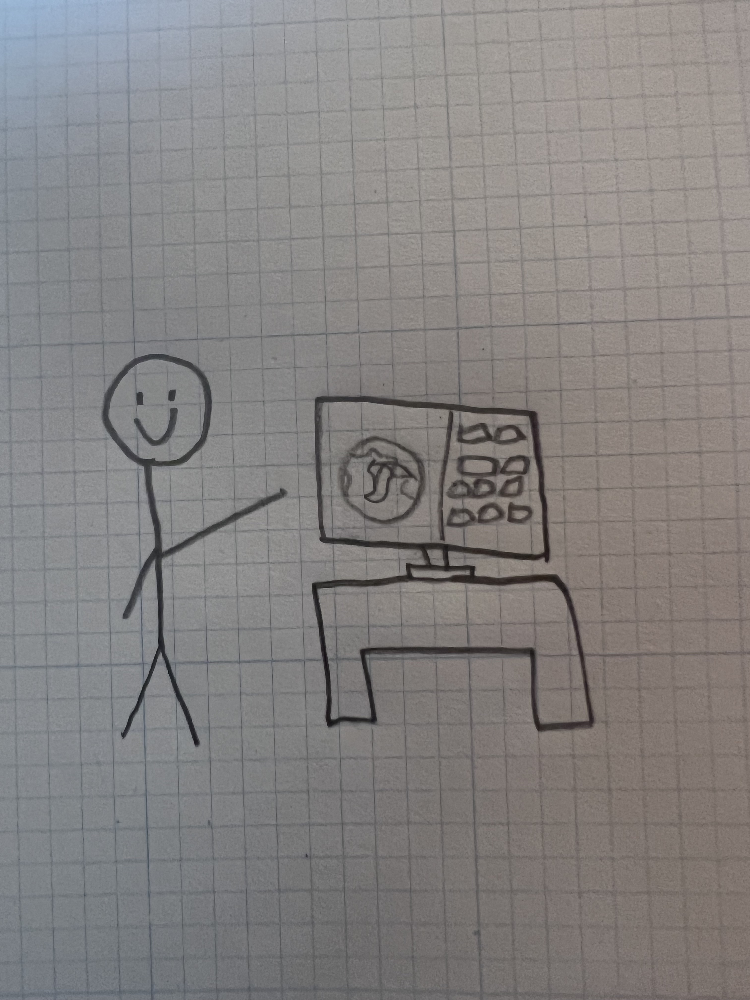

Checkout my interactive Mergers and Acquisitions geographical visualisation tool below! This was put together in just a few hours, alongside a group project I took part in on an insight week at [Bloomberg](https://www.bloomberg.com/company/). It is just a prototype, but I currently working on rewriting and updating the application with all the features implemented.

**Please note**: On mobile or small devices, for best experience please turn your device horizontally and <a href=".">refresh</a>. You are also recommended to use Google Chrome.

<iframe src="https://arthur-ma.vercel.app" height="400px" width="100%" allowfullscreen></iframe>

Alternatively, you can open it in a <a data-umami-event="Viewed MA App" href="https://arthur-ma.vercel.app">a new window</a>, or you can <a href="https://www.youtube.com/watch?v=jM_44xCzarQ" target="_blank">watch a video demo on YouTube</a>.

# Introduction

As part of an insight week at [Bloomberg](https://www.bloomberg.com/company/), as part of a group project we were tasked with creating a geographical visualisation tool for mergers and acquisitions. The idea was to create a tool that would allow a user to visualise the geographical spread of M&A deals, and to be able to filter the data by various different metrics.

We were given a vague prompt, and some suggestions and pointers on how to get started. The task was given to us on Tuesday, and we were to present our results on Thursday afternoon, with about 5 hours of work time allocated over the two days. I volunteered to draw a mockup of the application and how it could look, however shortly after attempting to do so, I realised that I am a terrible artist and that I would be better off just building the application instead. So I did.

# Technical Implementation

First of all, I had to find a dataset to use. It seemed unlikely that Bloomberg would be willing to give me access to directly query their database, so I had to make do with what I could find publicly. I found <a href="https://www.kaggle.com/datasets/shivamb/company-acquisitions-7-top-companies" target="_blank">a database on Kaggle</a> that I decided to use. It contains a list of a large number of acquisitions made by the top tech companies, including Google, Facebook, and Microsoft. It also had a few other columns I figured would be useful, including the company address, and details about the acquisition such as the price paid.

The first step was to clean the data. I used a combination of Python and Excel to do this. First of all I removed all rows that didn't have the data I required, for example the address. Obviously in a production product you would not want to do this, but I had just a few hours to build a prototype so I decided that I could just prune the dataset to fit my needs. The first challenge posed to me was that the address was not in a form that I could use very easily. Whilst the street name and postal code are useful for the likes of me and you to interpret, they are not very useful for a computer. I found a <a href="https://www.geoapify.com/tools/geocoding-online" target="_blank">geocoding tool</a> that allowed me to convert the address into a latitude and longitude, allowing me to actually use the data. Now I had all the data that I needed, and I just needed to build the application.

## API Server

I decided to seperate the application into a seperate client and server. Therefore for my API server, all I really needed was a few basic CRUD endpoints to allow the client to query the data. I decided to use FastAPI, as I have been using it a lot recently and I really enjoy it. Once I converted the Excel sheets into an SQL database, I was able to use SQLAlchemy to query the data. For my prototype, I basically only needed the following endpoints:
- `/api/ma` - Returns a list of all the M&A deals
- `/api/ma/{id}` - Returns a specific M&A deal
- `/api/companies` - Returns a list of all the companies
- `/api/companies/{id}` - Returns a specific company

With these endpoints done, I was able to move onto the client.

## Client

For my client I decided to use [React](https://react.dev), as I am quite comfortable with it and have been using it for a while. I was originally planning on using [NextJS](https://nextjs.org), but my project required the use of Three.js which doesn't play nicely with server-side-rendering. I found the library  [react-globe.gl](https://github.com/vasturiano/react-globe.gl) perfect for my needs - it offered a component to interact with a 3d globe, and provided methods to display and update data on it. Whilst I encountered quite a few teething issues with the library, stopping me from utilising all the features I wanted, I was able to get it working in the end. Combined with some other React components, a bit of CSS, some data fetching, and a few hours of work, I was able to put together the application you see above.

# Conclusion

Overall, considering I had about 5 hours to put all this together, I was quite pleased with the result. The prototype worked for the presentation, and we had a QR code that people could scan to try it out for themselves. I am currently rewriting the application from the ground up and trying to implement all the features that we planned on adding, such as more filters for deals, and a better UI. I have switched to [three-globe](https://github.com/vasturiano/three-globe) instead of react-globe.gl, as it is allowing me to have full control of the Three.js scene, allowing me to fix the issues I encountered in the prototype. Stay tuned to my site for potentially another blog post on the finished product!

I really enjoyed working on the project with my team, and I am very grateful to Bloomberg for the opportunity to do so. The week was extremely fun, and I learnt a lot about the company and the industry.